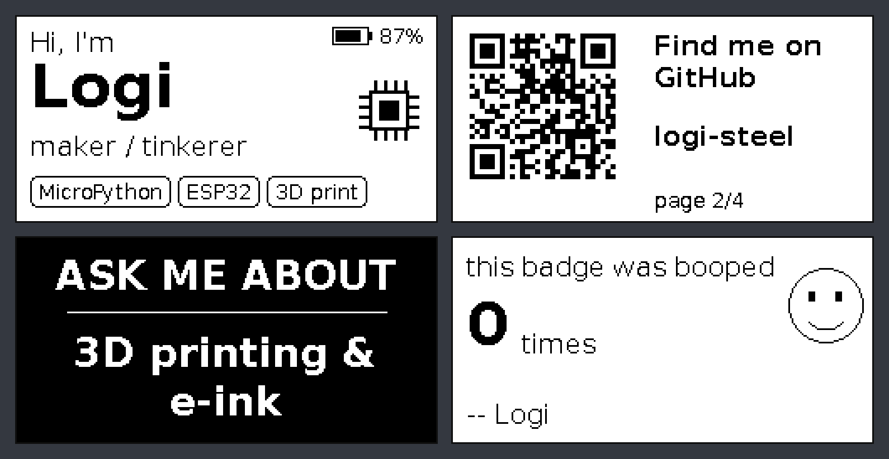
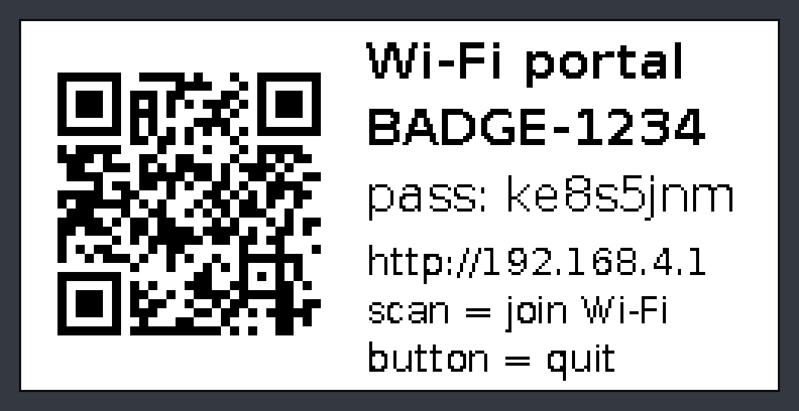
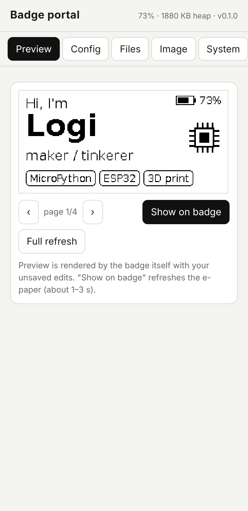
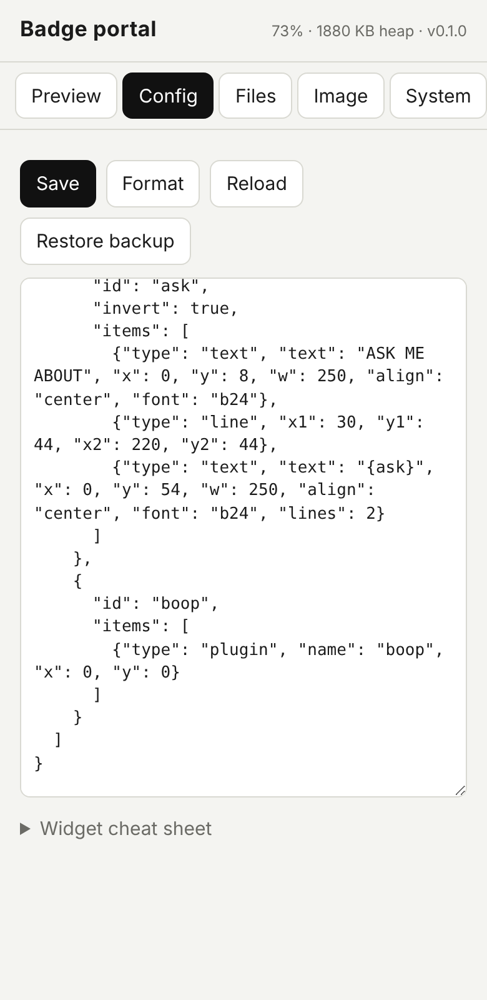
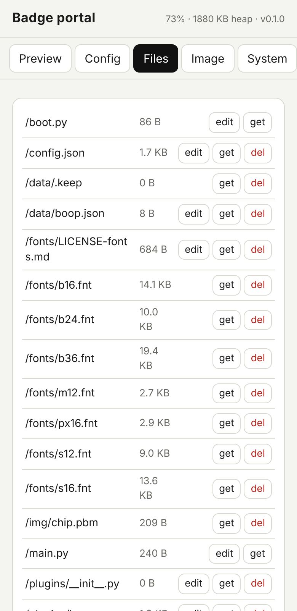
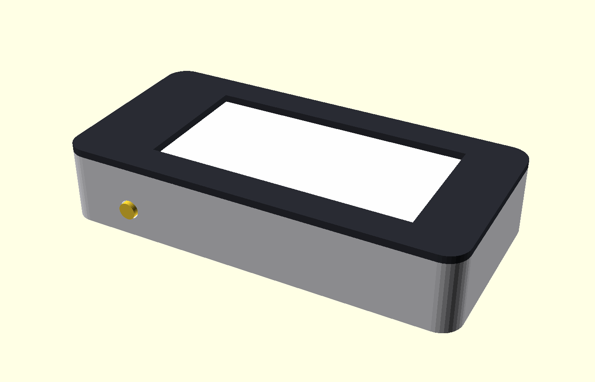
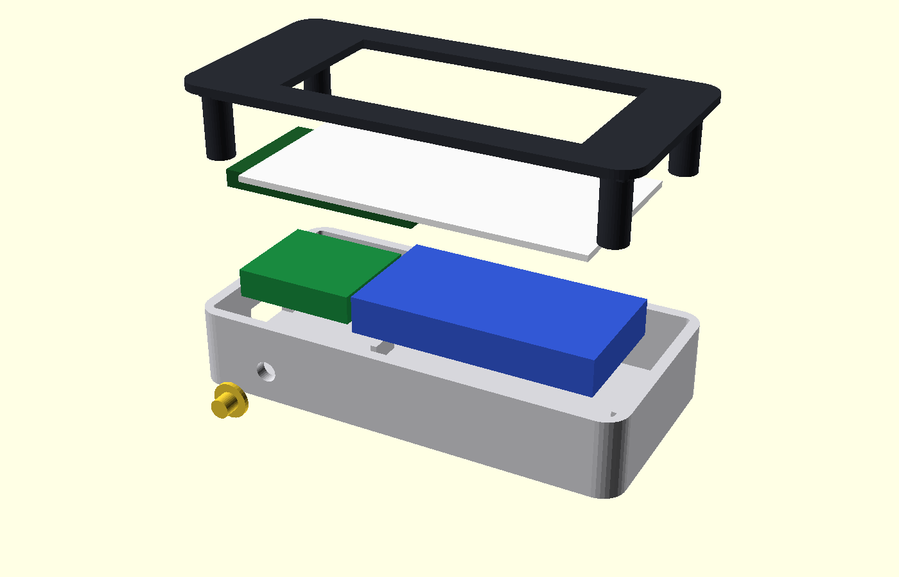
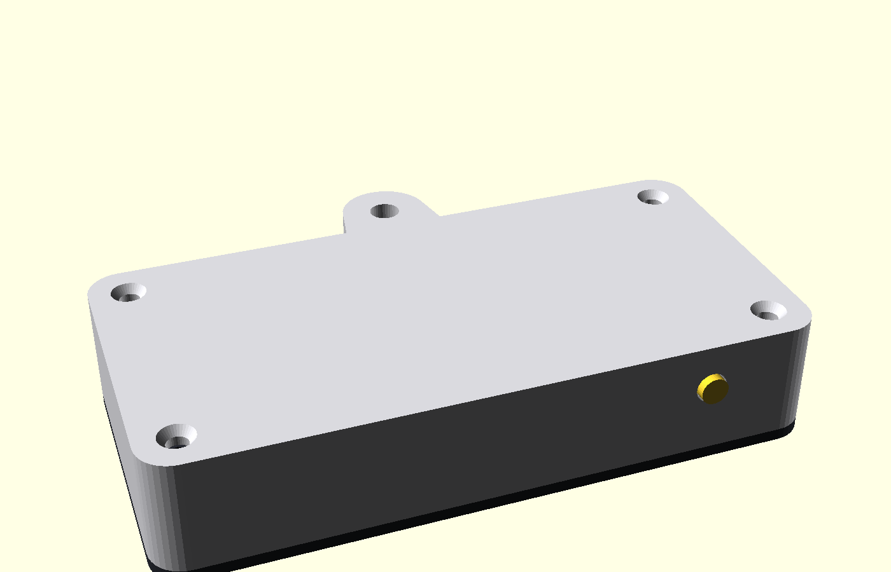
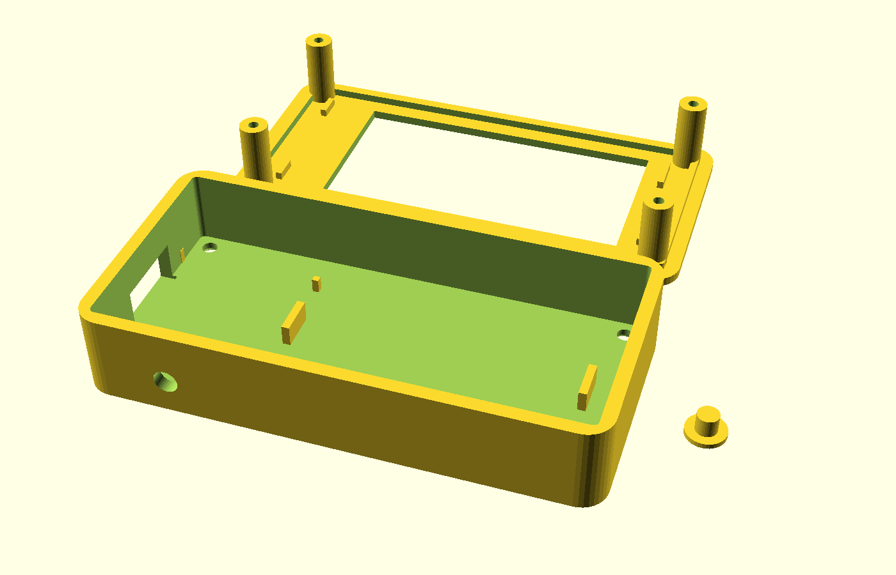

# my_bagde_maybe_public
some ai slop mixed with my learning lol 

# E-ink badge you can reprogram from your phone
**Some ai slop mixed with my learning so pls be carefull.**
A tiny name badge: ESP32-C3 + 2.13" e-paper, **MicroPython**, everything on the screen is described
by one `config.json`. Long-press the button, scan the QR code on the badge, and edit the layout,
add pages, upload images/fonts or even **change the Python code from your phone's browser**. No
PC, no toolchain, no recompiling.



*The picture above is rendered by the badge's own renderer running on a PC (`tools/preview.py`).*

* 250x122 e-paper, always readable, **zero power while showing a page** (deep sleep between presses)
* pages: text (Polish letters included), chips/tags, rectangles, lines, images (a full-screen picture from Canva & co,
  or pixel art typed as text), **QR codes** (generated on the
  device, so a vCard or link can be edited from the phone), battery gauge, and your own **Python plugins**
* Wi-Fi portal with live preview rendered *by the badge itself*, JSON editor, file manager, image
  converter (dithering in the browser), rollback buttons, captive-portal pop-up
* safe by design: configs are validated and `.py` files are compile-checked **before** they are written,
  the previous version is kept as `.bak`, a crashing widget draws a "!" instead of killing the page,
  and if a firmware upload breaks the startup the badge **rolls back to the `.bak` files by itself** (once,
  no ping-pong loops) and keeps the broken version as `.bak` so you can look at it
* 3D-printable case (OpenSCAD, parametric, interference-checked)

## Make your own graphics

> **Use this template to make your own badge graphics!** *(Dzięki temu szablonowi możesz robić własną grafikę!)*

[](templates/graphics/README.md)

Take [`badge_template_overlay.png`](templates/graphics/badge_template_overlay.png) into Canva (or any editor), make a page of
**1000 x 488 px**, lay the overlay over it, draw whatever you like (your cat, any text, anywhere) and delete the overlay
before exporting. Then **Image -> Full screen -> Upload & add as a page** in the badge's portal. The only limits are the
screen size and the red edge the case may hide - [how it works, with an example](templates/graphics/README.md).

> **Read "What is verified and what is not" below before you buy parts or print the case.**
> I had no physical hardware: everything was tested against simulators/mocks and datasheets.

---

## Why MicroPython and not C++?

You all maybe asking whether C++ could update JSON *and code* on the fly. Honest answer:

| | C++ (Arduino/ESP-IDF) | MicroPython |
|---|---|---|
| JSON edited at runtime | easy (ArduinoJson + LittleFS + web server) | easy (`json` is built in) |
| **code changed at runtime** | only as a full firmware OTA: compile on a PC, upload a `.bin`. "Hot" code means embedding an interpreter - i.e. rebuilding MicroPython, worse | **native**: the `.py` files *are* the program, upload one over Wi-Fi and it runs next boot |
| speed | 10-100x faster | irrelevant here: drawing a page takes milliseconds, the e-paper refresh takes seconds |
| RAM/flash | tiny | ~100 KB heap is enough; the C3 has 400 KB SRAM and 4 MB flash |
| battery | slightly better | the badge sleeps at ~uA between presses either way |

C++ would only win for fast animations on a colour TFT. For an e-ink badge it is a bad trade.
**Verdict: MicroPython.** (And I would not choose a colour screen: it needs a backlight and lasts hours,
not weeks.)

---

## Hardware

| Part | What / why | Source of the numbers |
|---|---|---|
| **Seeed XIAO ESP32-C3** | 21 x 17.8 mm, USB-C, **LiPo charger on board**, 4 MB flash, external antenna included | [Seeed wiki](https://wiki.seeedstudio.com/XIAO_ESP32C3_Getting_Started/) |
| **2.13" e-paper, 250x122, B/W, SSD1680** | panel 29.2 x 59.2 x 1.05 mm, active area 23.71 x 48.55 mm, full refresh ~2-3 s, partial ~0.3-0.4 s | [Waveshare datasheet](https://files.waveshare.com/upload/e/e6/2.13inch_e-Paper_Datasheet.pdf), [Waveshare spec](https://www.waveshare.com/2.13inch-e-paper-hat.htm), [Good Display GDEY0213B74](https://eckstein-shop.de/GooDisplay-Marken-EN__213_1) |
| **display driver board** | a bare panel (24-pin 0.5 mm FPC) cannot be driven directly: the datasheet's reference circuit adds a MOSFET (GDR pin drives it), a 68 uH inductor, Schottky diodes and 1-4.7 uF capacitors. Buy a panel **with** its adapter board. SPI pins: VCC GND DIN CLK CS DC RST BUSY | [Waveshare pin table](https://www.waveshare.com/2.13inch-e-paper-hat.htm) |
| LiPo pouch cell, **>= 380 mAh**, max 6.5 x 21.5 x 42 mm | e.g. "602040" class (6.0 x 20 x 40, ~420 mAh). Seeed's wiki lists **380 mA** fast-charge, another source says 100 mA - measure before trusting it. At 380 mA a 250 mAh cell would charge at 1.5C, so take >= 380 mAh | [Seeed wiki](https://wiki.seeedstudio.com/XIAO_ESP32C3_Getting_Started/), [cell example](https://probots.co.in/3-7v-420mah-lipo-battery-602040-rechargeable-lithium-polymer-cell-with-protection-pcb.html) |
| tact switch 6x6x4.3 mm | the badge's only button | common part |
| 100 kohm resistor | **external pull-up on the button** (see below) | my design |
| optional: 2 x 470 kohm + 100 nF | battery % readout | my design |
| 4 x M2 x 8 countersunk screws | case | |

The Waveshare "e-Paper (Driver) HAT" boards are 65 x 30.2 mm Raspberry-Pi-HAT sized with a 40-pin header
([source](https://welectron.com/Waveshare-13512-e-Paper-Driver-HAT)); they do **not** fit the 34 x 21 mm driver
zone of the case without changing `drv` / `ci_y` in `case/badge_case.scad` (the asserts will tell you).

### Wiring (Seeed XIAO ESP32-C3 pin names -> GPIO from the [Seeed pin table](https://wiki.seeedstudio.com/XIAO_ESP32C3_Getting_Started/))

```
XIAO pin   GPIO   to
-------------------------------------------------
D8         8      e-paper CLK   (SPI SCK)
D10        10     e-paper DIN   (SPI MOSI)
D3         5      e-paper CS
D4         6      e-paper DC
D5         7      e-paper RST
D0         2      e-paper BUSY
3V3        -      e-paper VCC
GND        -      e-paper GND

D1         3      button -> GND,  AND 100k from D1 to 3V3   <- external pull-up
D2         4      (optional) midpoint of 2x470k from BAT+ to GND, 100 nF to GND, then set hardware.bat_adc = 4
BAT+/BAT-  -      LiPo (check the polarity printed on YOUR board before soldering!)
```

Why these pins (all checked in the MicroPython v1.29.0 source / Seeed docs, not guessed):

* **GPIO20/21 are not used**: the `ESP32_GENERIC_C3` build runs the REPL on UART0 there (`MICROPY_HW_ENABLE_UART_REPL`),
  an e-paper BUSY line wired to GPIO20 would type into the REPL.
* **GPIO9 is not used**: it is the BOOT strapping pin, a BUSY signal low at reset could put the chip in download mode.
* the button must be on **GPIO0-5**: only those can wake an ESP32-C3 from deep sleep (`machine.deepsleep` +
  `esp32.wake_on_gpio`). The internal pull-up is not guaranteed to survive deep sleep, hence the 100 kohm resistor.
* the config has a `hardware` section, so another wiring is a JSON edit, not a code change.

---

## Install

1. **Flash MicroPython** (v1.29.0 for `ESP32_GENERIC_C3`, [download page](https://micropython.org/download/ESP32_GENERIC_C3/)):

   ```sh
   pip install esptool mpremote
   esptool.py erase_flash
   esptool.py --baud 460800 write_flash 0 ESP32_GENERIC_C3-20260824-v1.29.0.bin
   ```
   If the board is not detected, hold **BOOT** while plugging in USB.
2. **Copy the firmware**: `python3 tools/deploy.py --reset`  (prints the `mpremote` command; `--dry-run` only prints).
3. The badge shows page 1 after a few seconds. Press the button for the next page.

Update later with `python3 tools/deploy.py --code-only` (keeps your `config.json`, plugins and images).

## Using the badge

| Action | Result |
|---|---|
| tap | next page (fast partial refresh; every 10th change is a full refresh to clear ghosting) |
| hold ~2 s | **Wi-Fi portal**: the e-paper shows a QR code that joins the badge's Wi-Fi |
| button in the portal | quit portal |



1. Hold the button until the portal screen appears, scan the QR code (or type the SSID/password).
2. Open `http://192.168.4.1` (most phones pop it up automatically; a catch-all DNS makes that work).
3. **Preview** tab: live preview rendered by the badge with your unsaved edits - **Show on badge** refreshes the e-paper.
4. **Config** tab: edit the JSON, **Save**. **Files** tab: edit `.py`/`.json`, upload fonts/images/plugins, undo.
5. **Image** tab: pick a picture, it is dithered in the browser; **Upload & add as a page** uploads it as a `.pbm`
   and puts it on a new page (**Full screen** sizes it to the whole display) - see [make your own graphics](templates/graphics/README.md).
6. The portal closes after 5 idle minutes or on a button press, then the badge reboots into the new config.

  

Developing over USB: set `"sleep": "none"` in `config.json` and the badge stays awake (USB serial stays up) so
`mpremote` / `deploy.py` can reach it; set it back to `"deep"` for battery life.

Security: the Wi-Fi is WPA2 with a fresh random password on every portal start (shown on the e-paper). Whoever
joins can upload Python, so treat the password like a root password - that is the price of "change the code from
the phone". The portal only runs when you ask for it.

### config.json in 60 seconds

```jsonc
{
  "device": { "rotation": 0, "sleep": "deep", "full_refresh_every": 10, "auto_rotate_min": 0, "long_press_ms": 1200 },
  "vars":   { "name": "Logi", "role": "maker" },          // used as {name}, {role} in any text
  "pages": [
    { "items": [
        { "type": "text",  "text": "Hi, I'm", "x": 8, "y": 6,  "font": "s16" },
        { "type": "text",  "text": "{name}",  "x": 8, "y": 20, "font": "b36" },
        { "type": "chips", "items": ["MicroPython", "ESP32"], "x": 8, "y": 95, "font": "s12" },
        { "type": "qr",    "data": "https://github.com/logi-steel", "x": 140, "y": 4, "size": 110 },
        { "type": "battery", "x": 188, "y": 6 }
    ] },
    { "invert": true, "items": [ { "type": "text", "text": "ASK ME ABOUT", "x": 0, "y": 40, "w": 250, "align": "center", "font": "b24" } ] }
  ]
}
```

| widget | fields |
|---|---|
| `text` | `text x y [w align=left\|center\|right wrap lines gap font ink]`; `{vars}`, `{battery}`, `{page}`, `{pages}` |
| `rect` / `circle` / `line` | `x y w h [r fill ink]` / `x y r [fill]` / `x1 y1 x2 y2 [thickness]` |
| `image` | `src x y [scale invert opaque ink]` - 1-bit PBM from `tools/img2pbm.py` or the Image tab; `scale` enlarges by whole pixels, `opaque` paints the paper too |
| `art` | `rows[] (or data "..\|..") x y [scale on invert opaque ink]` - pixel art typed as text: `#` = ink, `.` = nothing (`tools/pixelart.py` converts to/from PBM and images) |
| `qr` | `data x y [size \| scale, ecc=L\|M\|Q\|H, border]` - up to 271 bytes at ECC L |
| `chips` | `items[] x y [w font padx pady gap r fill]` |
| `battery` | `x y [text]` (needs the divider on GPIO4 and `"hardware": {"bat_adc": 4}`; draws nothing otherwise) |
| `plugin` | `name x y ...your own keys` -> runs `plugins/<name>.py` |

Fonts: `s12 s16 b16 b24 b36 m12 px16` (DejaVu + Unifont, with Polish letters), `8x8` / `8x8x2` built in. Add your own with
`python3 tools/make_font.py --ttf X.ttf --size 20 --out firmware/fonts/x20.fnt` and upload it.

`rotation`: **0** = landscape with the FPC edge on the left, **180** = flipped, **90/270** = portrait. If the picture is
upside down, change 0 <-> 180 (I could not verify the orientation without a panel).

### Plugins = code you can change from the phone

`plugins/boop.py` is a working example (a persistent "booped N times" counter). A plugin is a function:

```python
def draw(c, item, ctx):      # c: Canvas, item: its JSON object, ctx: fonts/vars/page info
    ctx.font("b24").draw(c, ctx.fmt("Hi {name}"), item.get("x", 0), item.get("y", 0))
    c.rect(0, 0, c.w, 2, 0, True)
```

Upload it in the **Files** tab (or edit it there), add `{"type": "plugin", "name": "yourfile"}` to a page and watch the
preview change. Uploads are compile-checked first; **undo** swaps the old version back.

### Preview without hardware

```sh
sudo apt install micropython python3-pil     # or any MicroPython unix port + Pillow
python3 tools/preview.py                      # firmware/config.json -> docs/img/preview.png
python3 tools/preview.py my.json out.png --rotation 90
```

---

## Power

Numbers from the datasheets, **not measured by me**: XIAO ESP32-C3 deep sleep 44 uA (Seeed), e-paper standby < 0.01 uA
(Waveshare), refresh ~26 mW for a second or two, Wi-Fi ~75 mA but only while the portal is open. The e-paper keeps
the image without power, so a badge that is flipped a few times a day should run for months on a 400 mAh cell
(the optional battery divider with 2x470k adds ~4 uA, a battery self-discharge will matter more).

## 3D-printed case

 
 

Ready STLs are in [`case/stl`](case/stl) (`shell`, `bezel`, `cap`, `fit_test`, `gauge`); everything is parametric in
[`case/badge_case.scad`](case/badge_case.scad). 75 x 37 x 14.85 mm (+ a lug on the top edge for a lanyard).

* two parts closed with **4 x M2 x 8 countersunk screws from the back** (nothing on the front), the front plate has a
  lip that centres it, panel stops and four screw columns
* USB-C opening in the left wall (charging and flashing without opening the badge), button on the bottom edge,
  lanyard lug on the top edge, optional 6 x 2 mm magnet pockets (`magnets = true`), `fpc_left` for the other orientation
* print in PLA/PETG, 0.2 mm layers, 3 walls, **no supports**: `shell` open side up, `bezel` window side **down**, `cap` standing up

**Print the two small test pieces first** (a few minutes each):

* `fit_test.stl` - the front plate with the window and lip: drop your panel in, does the active area line up with the window?
* `gauge.stl` - slots for your XIAO, battery, driver board and switch: do they really fit?

Then adjust the parameters at the top of the `.scad` file (`aa_far`, `drv`, `xiao`, `bat`, ...) and re-export.

Build order: wire everything (see above) -> battery and XIAO into the shell (USB-C towards the left wall opening) ->
driver board above them -> panel into the bezel (thin double-sided tape, FPC folded behind it) -> bezel on the shell
-> 4 screws -> press the cap into the bottom-edge hole before closing.

`python3 tools/check_case.py` rebuilds the STLs and verifies: OpenSCAD asserts, no overlap between the stand-ins for panel /
driver / XIAO / battery / switch and the printed parts (also for `fpc_left=false` and `magnets=true`), every STL is a closed
solid, and an oversized battery trips an assert.

---

## What is verified and what is not

**Verified from primary sources** (datasheets / source code, with links above):
panel outline, active area and pixel count; SPI pin names and 3.3 V operation; XIAO ESP32-C3 size, pin-to-GPIO table,
BOOT pin, USB-serial console, external antenna; MicroPython v1.29.0 facts the firmware relies on (AP config keys,
`wake_on_gpio` is implemented via `esp_deep_sleep_enable_gpio_wakeup`, `machine.wake_pins()`, `PIN_WAKE` = EXT0,
UART REPL on GPIO20/21, `RTC.memory` 2048 bytes, `ADC.read_uv`, C3 has only `SPI(1)`); the e-paper register sequences
(copied from Waveshare's driver).

**Tested on the host (all green, `tests/run.sh`)**:

| suite | what it proves |
|---|---|
| `display` | every one of the 30,500 logical pixels lands on the right native pixel of a simulated SSD1680 for all 4 rotations; full/partial/sleep/busy-timeout sequences |
| `qr` | the on-device QR encoder is **bit-identical** to `python-qrcode` for v1-v10 x L/M/Q/H x 8 masks, capacities match `segno`, codes decode with OpenCV |
| `layout` | JSON -> pixels, wrapping, alignment, widget error isolation, config validation, atomic save + backup + fallback |
| `app` | the whole wake -> render -> SPI -> sleep flow: power-on, tap, partial/full cadence, auto-rotate timer, long press, stuck button, missing panel, crash screen, dev mode |
| `power` | battery percentage curve and ADC path, button helpers |
| `recover` | a broken over-the-air update: automatic rollback, the broken file stays as `.bak`, no rollback loop when both versions are bad, an hour of sleep instead of a crash loop |
| `portal` | real HTTP + DNS against the firmware: config save/restore, validation, draft preview, plugin upload + hot reload + rollback, syntax-error rejection, path traversal, size limits, 6 parallel clients, idle/button quit - and the **join QR decoded from the simulated e-paper pixels equals the Wi-Fi credentials** |
| `tools` | img2pbm, make_font, deploy command, preview |
| `graphics` | `art` / `scale` / `opaque` / `invert` drawn pixel for pixel, PBM reader limits, bad input rejected without crashing the page |
| `pixelart` | `tools/pixelart.py` round trips (text <-> PBM <-> image) through the firmware's own reader and validator; PBM polarity checked against ImageMagick |
| `graphics_template` | the template PNGs: sizes, transparent inside, red edge all round, they are exactly what `tools/make_graphics_template.py` makes; the cat example converts to a valid 250x122 PBM |
| `portal_ui` | headless Chromium against the simulated badge: choose a picture -> Full screen -> Upload & add as a page; the page lands in the config once, the `.pbm` is 250x122, no JS errors (skipped when playwright/chromium is missing) |
| web UI | also driven by hand with headless Chromium earlier (found and fixed a real bug that way) |
| case | see above |

**NOT verified - no hardware, no way for me to check:**

1. **Real panel behaviour**: the driver follows Waveshare's sequences, but I could not run it. Partial refresh after
   deep sleep assumes the panel keeps its RAM in sleep mode 1 (datasheet says so). If you see garbage/ghosting set
   `"full_refresh_every": 1`.
2. **Orientation**: rotation 0 vs 180 can be flipped (the panel scan direction vs the case is not in the datasheet).
3. **XIAO charge current**: Seeed's wiki says 380 mA, another source 100 mA. Measure before charging a small cell.
4. **Window offset in the case**: `aa_far = 3.05` comes from the drawing of the *older* 2.13" panel generation (same
   outline). The SSD1680 version is expected to be mechanically identical, but print `fit_test.stl` first.
5. **Assumed sizes**: driver board 34 x 21 x 3 mm, XIAO thickness 5 mm (one source), XIAO PCB 1 mm, LiPo envelope.
6. **Timing on the C3**: host renders in 1-15 ms; the C3 is far slower but the e-paper refresh (seconds) dominates.
   Heap use on the C3 is not measured.
7. Host tests ran on MicroPython 1.22.1 (the apt build); the device runs 1.29.0. Differences were checked in the
   1.29.0 sources only where the firmware depends on them.

## Repository layout

```
firmware/   what goes on the badge (main.py, badge/ package, web/index.html, fonts/, img/, plugins/, config.json)
case/       badge_case.scad + stl/
templates/  graphics/: the template for your own graphics, how-to and a worked example
tools/      deploy.py  preview.py  make_font.py  img2pbm.py  pixelart.py  make_graphics_template.py  check_case.py
tests/      run.sh (host test runner), mocks/ (machine, esp32, network, SSD1680 simulator), test_*.py
docs/img/   pictures used in this README
```

Run all tests: `sudo apt install micropython openscad xvfb && pip install pillow numpy opencv-python-headless segno qrcode trimesh fonttools mpremote && tests/run.sh`
(add `playwright` + its chromium for the browser test; ImageMagick's `convert` for the PBM polarity check)
(the runner downloads the pure-Python part of MicroPython's `asyncio` for the unix port into `tests/.hostlib`).

## Credits and licences

Code: MPL-2.0 (see `LICENSE`). E-paper command sequences derive from Waveshare's
[e-Paper](https://github.com/waveshareteam/e-Paper) driver (MIT-style licence). Fonts: see
[`firmware/fonts/LICENSE-fonts.md`](firmware/fonts/LICENSE-fonts.md) (DejaVu, GNU Unifont).
