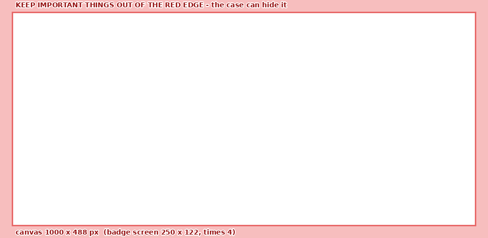
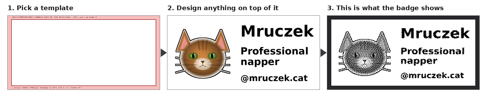

# Make your own badge graphics

> ## Use this template to make your own badge graphics!
> *(Dzięki temu szablonowi możesz robić własną grafikę!)*



The whole screen is yours. The template only shows the two things you cannot change:

| | |
|---|---|
| **the size** | the badge screen is **250 x 122 px**. The template is that **x 4 = 1000 x 488 px**, big enough to work comfortably. |
| **the red edge** | a safety margin of 6 badge pixels (about 1.2 mm; 24 px here). In my case design the window is only 0.4 mm larger than the screen per side, and where the window really sits relative to the panel is not verified (see the main README), so the case may cover a bit of the edge. Do not put anything you need there - a photo may run into it, a name may not. |

Nothing else is prescribed: no zones, no grid, no fonts. A photo of your cat across the whole screen is fine, so is one
word in giant letters.



*Example: `example/cat_design.png` is the middle picture; the right one is rendered by the badge's own renderer.
The cat is drawn by a script (`example/make_example.py`), a real photo works the same way.*

## How

1. **Take the template.** Use `badge_template_overlay.png` (transparent, only the red edge) - it lies on top of your
   design. `badge_template.png` is the same thing on white with a caption, for looking at.
2. **Open Canva** (or Photopea, Figma, GIMP, Paint.NET - anything that can make a page of an exact size and import a PNG):
   create a **custom size 1000 x 488 px**, upload the overlay and stretch it over the whole page.
3. **Design whatever you want** under the overlay: your cat, text, shapes. Keep the important parts out of the red edge.
4. **Delete (or hide) the overlay** and download the page as **PNG** (or JPG).
5. **On the badge:** hold the button ~2 s, scan the QR code to join its Wi-Fi, open `http://192.168.4.1`,
   tab **Image** -> choose your file -> **Full screen** -> **Upload & add as a page**. The page shows up in the
   preview; tap the button on the badge to flip to it.

I could not try Canva's menus - they change - so step 2 is the idea, not a click-by-click guide. The template is an
ordinary PNG, nothing Canva-specific. Step 5 was driven in a real browser against the simulated badge
(`tests/test_portal_ui.py`).

## What the screen can and cannot do

* **Only black and white.** No grey, no colour. Photos are turned into dots (*dithering*) - that is what the cat above
  looks like, and it is fine. Leave **dither** on for photos, switch it off for flat black-and-white art, logos and
  text (crisp edges, no dots).
* **A background that is not pure white turns into dots**, too: even a very light grey (248) becomes a sprinkle of dots.
  Make the backdrop *pure white* (`#FFFFFF`) and keep the photo's subject dark enough, with a clear outline.
* **Small text** gets hard to read. Look at the live preview and make it bigger if you squint.
* **Forgot the overlay?** With dither on it comes out as a faint dotted frame, with dither off it disappears. Re-export
  without it.
* **Portrait** (`"rotation": 90` in the config): use `badge_template_portrait*.png` (488 x 1000). **Full screen** reads the
  rotation from the badge and picks the width (122) for you.
* Other sizes work too: the portal scales to the chosen width and keeps the proportions (a picture that is
  not 250:122 simply leaves white space or is cut at the bottom).

## Beyond one picture

* A picture is just an **`image` widget** - `{"type": "image", "src": "img/photo.pbm", "x": 0, "y": 0}`. Other widgets
  (text with `{battery}`, a QR code, ...) can sit on top of it, and the pages you add are ordinary entries in
  `config.json`, so you can reorder, rename or delete them in the **Config** tab.
* `image` also takes `scale` (whole-number enlargement, crisp), `invert` and `opaque` - see the main README.
* **Draw with the keyboard**: the `art` widget and `tools/pixelart.py` turn text characters into pixels
  (`.` = nothing, `#` = ink) - good for icons, logos and pixel-art.

## From the command line (no portal)

```sh
python3 tools/img2pbm.py my_design.png cat.pbm --width 250               # dithered, for photos
python3 tools/img2pbm.py my_design.png cat.pbm --width 250 --threshold   # hard black/white
```

Upload `cat.pbm` to `img/` on the badge (portal **Files** tab, or over USB with `mpremote fs cp`) and add the `image`
widget above to a page.

## Files

| file | what |
|---|---|
| `badge_template_overlay.png` | **the one you lay over your design** (1000 x 488, transparent) |
| `badge_template.png` | the same, on white, with a caption - for looking |
| `badge_template_1x.png` | 250 x 122, for editors that work in exact screen pixels |
| `*_portrait*.png` | the same three, 488 x 1000 / 122 x 250 |
| `example/` | the cat: `cat_design.png` (what you export), `cat.pbm` (what the badge gets), `cat_on_badge.png`, `flow.png`, and `make_example.py` |

Regenerate the template with `python3 tools/make_graphics_template.py` (needs Pillow). The tests check that the PNGs
here are exactly what that script makes (`tests/test_graphics_template.py`).
